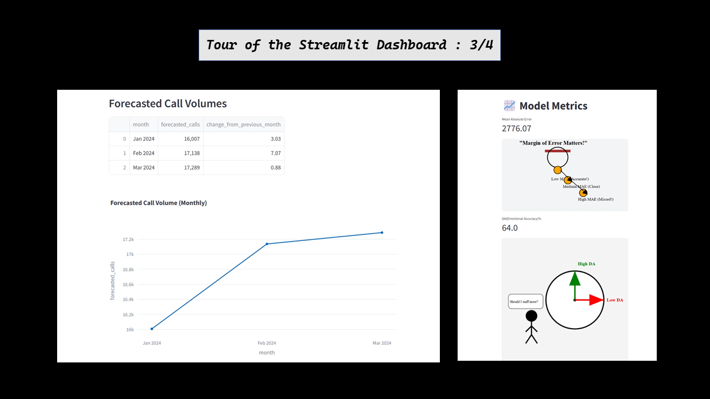

# Call Volume Forecasting for Healthcare Call Centers  

## Business Objective  
The goal of this project is to develop a time-series forecasting model to predict monthly call volumes in healthcare call centers. This will help call center managers optimize staffing, reduce patient wait times, and improve service quality by ensuring adequate phone lines and resources are available.  

By accurately forecasting call volumes, stakeholders can:  

- Optimize staffing schedules to reduce agent burnout and improve efficiency. 
- Identify seasonal trends in call volume and prepare in advance.  
- Minimize patient wait times by ensuring appropriate resource allocation.  
- Improve overall service quality and patient satisfaction.  

## Project Overview  
- Developed a **time-series forecasting model** to predict monthly call volumes in healthcare call centers.  
- Achieved **MAE: 2776.07** and **Directional Accuracy (DA): 63.64%**, ensuring reliable predictions for staffing optimization.  
- Processed historical call volume data using **Pandas and NumPy** for effective time-series modeling.  
- Conducted **Exploratory Data Analysis (EDA)** to identify seasonality and trends affecting call center traffic.  
- Evaluated forecasting models, selecting **ARIMA (1,1,4)** for optimal accuracy.  
- Deployed an **interactive dashboard** using **Streamlit** for real-time forecast visualization.  
- Integrated the solution with **FastAPI (backend), Docker (containerization), and Render.com (deployment)** to ensure scalability and accessibility.  

## Resources & Documentation  

- **Python Version** → 3.10
- **Project Technical Documentation** → [Technical Docs](./docs/Technical_Details.md)  
- **Dataset Source** → [Dataset](data/raw/CallCenterData.csv)  
- **Live Demo** → [Application Link](https://call-forecasting-frontend-service-v1.onrender.com/)  
- **Postman Collection** → [API Testing Collection](https://crimson-equinox-345795.postman.co/workspace/My-Workspace~393a6c73-8b4d-435b-8c76-ad0f04e4d33b/collection/26974525-493702fa-315d-45f5-88d8-25942f053f0a?action=share&creator=26974525)

## Screenshots

## EDA  

### **Trend Analysis**
- A significant upward trend was observed in the data, indicating an increasing call volume over time.
- This trend remained consistent even after seasonal adjustments.

### **Seasonality Analysis**
- Slight seasonality was identified, particularly in March and October, suggesting higher healthcare-related call volumes during these months.
- Seasonality was determined to be additive.

### **Stationarity Check**
- After applying first-order differencing, the data became stationary, as evidenced by the autocorrelation (ACF) and partial autocorrelation (PACF) plots.

Below are a few highlights of the EDA analysis :  

    
    
    

## Model Building  
- The dataset consists of **132 months**, meaning **120 months are used for training**, and **the last 12 months are used for testing**.  
- Evaluated baseline models to establish initial performance benchmarks.  

### **Baseline Models**
Before selecting the final model, multiple time-series models were evaluated to determine the best-performing approach for forecasting.

| Model                | MAE (Test)  | DA (Test)  | AIC     | BIC     |
|----------------------|------------|-----------|---------|---------|
| **MA(1)**           | 2069.47     | 0.5455    | 1936.55 | 1944.91 |
| **AR(1)**           | 2861.39     | 0.4545    | 1947.64 | 1956.00 |
| **Combined ARMA(1,1)** | 3381.94  | 0.5455    | 1953.54 | 1964.69 |

Among the evaluated models, **MA(1) (ARIMA(0,1,1))** achieved the lowest Mean Absolute Error (MAE) of **2069.47** and a **Directional Accuracy (DA) of 0.5455**.  
While AR(1) and ARMA(1,1) were considered, they exhibited higher MAE values and did not significantly improve DA.

---

### **Advanced Model Selection**
- Selected **ARIMA(1,1,4)** for its optimal accuracy and balance of computational efficiency.  

#### **Why ARIMA(1,1,4)?**
- **Lower AIC/BIC values** indicating better model fit.  
- **Better MAE and DA scores** compared to other tested models.  
- **Captures trends effectively** without excessive complexity.

### **Fine-Tuning Strategy**
- **Moving Average (q):** Explored values around **q=4**.  
- **Differencing Order (d):** Fixed at **d=1** for stationarity.  
- **Auto-Regressive Order (p):** Evaluated **p=1 to 5**, with **p=1** performing best.  

**Best ARIMA Order:** **(1,1,4)**  
**Directional Accuracy (DA):** **0.6364**  
**Mean Absolute Error (MAE):** **2776.07**  

## Deployment and Serving  

### Model Deployment  
- Deployed using **FastAPI** for real-time inference.  
- Frontend built with **Streamlit**.  
- Hosted on **Render.com** (free instance).  

### Microservices Architecture  
- **API Service:** FastAPI + Model Inference.  
- **Frontend Service:** Streamlit UI.  
- **Dockerized Deployment** for portability.  

### CI/CD Pipeline  
- **GitHub Actions** automates deployments.  

### Monitoring & Logging  
- **Custom Logging Module** implemented.  
- Observability setup planned for future iterations.  

### Deployment Infrastructure  

| Component      | Technology Used          |
|---------------|--------------------------|
| Model Server  | FastAPI + Uvicorn        |
| Frontend      | Streamlit                |
| Deployment    | Render.com (Free Instance) |
| CI/CD         | GitHub Actions           |
| Containerization | Docker                 |

