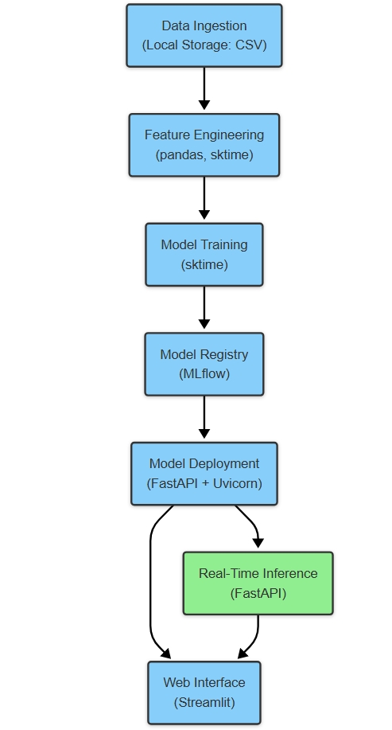

# Technical Documentation: 

## 1. Requirements Gathering

### A. Scope Clarification

1. **What is the system supposed to do?**
   - Predict call volumes for the healthcare domain in a call center on a monthly basis.

2. **Who are the primary users?**
   - Healthcare call center managers and operation heads responsible for resource planning and workforce management.

3. **What are the boundaries of the system?**
   - The system focuses only on forecasting healthcare call volumes, not handling actual call operations or customer interactions.
   - It relies on historical call data.

4. **What problem are we solving for the stakeholders?**
   - Helping call center managers optimize staffing and resources based on forecasted call volume.
   - Reducing operational inefficiencies by providing accurate demand predictions.
   - Preventing service delays and ensuring customer satisfaction by anticipating high-traffic periods.

### B. Functional Requirements

1. **Prediction Functionality:**
   - Forecast the number of calls received in the healthcare domain for future months using a time series model.

2. **Data Handling:**
   - Ingest and preprocess monthly healthcare call data.
   - Handle missing values, normalize numerical features, and encode categorical ones.

3. **Model Evaluation:**
   - Evaluate forecast accuracy using metrics like Mean Absolute Error (MAE) and Directional Accuracy (DA).
  
4. **Web Application Integration:**
   - Develop an interactive dashboard where stakeholders can:
     - View historical call trends.

### C. Non-functional Requirements

1. **Performance:**
   - Forecasts should be generated in under 2 seconds for seamless interaction within the web application.

2. **Reliability:**
   - The system should produce consistent forecasts across multiple runs with minimal variance.

3. **Maintainability:**
   - Use modular and well-documented code to enable easy updates and debugging.

4. **Usability:**
   - Provide an intuitive and visually engaging interface that simplifies forecasting for call center managers.

## 2. Architecture Planning

### High-Level Architecture

Below is the high-level architecture overview:

  

*Figure: High-Level Architecture Overview illustrating the data flow from ingestion to real-time inference.*

### Technology Stack & Justifications

| Component            | Technology Choices                         | Justification |
|----------------------|-------------------------------------------|--------------|
| **Data Ingestion**   | Local Storage (CSV)                      | Since this is a PoC with limited data, local storage is sufficient. Can be extended to a database if needed. |
| **Feature Engineering** | sktime, pandas                        | sktime provides robust time series preprocessing and transformation tools. |
| **Model Training**   | sktime                                  | Designed specifically for time series forecasting with built-in support for various models. |
| **Model Registry**   | MLflow                                    | Tracks experiments, manages models, and supports versioning. |
| **Model Deployment** | FastAPI + Uvicorn                         | Lightweight, scalable API framework for real-time inference. |
| **Inference**        | FastAPI Endpoints                         | Ensures real-time predictions with low latency. |
| **Web Interface**    | Streamlit                                 | Interactive UI for user input, visualization, and displaying model results. |

### Evaluation Strategy and Key Metrics

| **Layer**              | **Evaluation Strategy**                                                                             | **Key Metrics**                              |
| ---------------------- | --------------------------------------------------------------------------------------------------- | -------------------------------------------- |
| Modeling Frameworks    | Parameter tuning, and performance benchmarking using sktime.                     | MAE (low deviation preferred), DA (> 60%). |
| Web Application        | Usability tests with stakeholders, app responsiveness checks.                                       | Interaction time (<2 seconds).               |

### Key Metrics

| **Metric**                    | **Technical Meaning**                                                | **Business Relevance**                                                  | **Example Outcome**                                                |
| ----------------------------- | -------------------------------------------------------------------- | ----------------------------------------------------------------------- | ------------------------------------------------------------------ |
| **Mean Absolute Error (MAE)** | Quantifies average deviation of predicted values from actual values. | Low MAE ensures more accurate workforce and call volume forecasting.    | "Predicted call volume deviation within ±50 calls."               |
| **Directional Accuracy (DA)**  | Measures the percentage of correctly predicted direction of change. | High DA ensures consistency in forecasting trends.              | "Forecasted trends match actual trends in 85% of cases."          |
| **Interaction Time**          | Measures web app responsiveness.                                     | Enhances user satisfaction with seamless interactions.                  | "Predictions generated within 1.5 seconds for 95% of inputs."      |

## 3. Training Infrastructure

### Model Selection Process

### **Baseline Models**
Before selecting the final model, we evaluated multiple time series models to determine the best-performing approach for forecasting.

| Model                | MAE (Test)  | DA (Test)  | AIC     | BIC     |
|----------------------|------------|-----------|---------|---------|
| **MA(1)**           | 2069.47     | 0.5455    | 1936.55 | 1944.91 |
| **AR(1)**           | 2861.39     | 0.4545    | 1947.64 | 1956.00 |
| **Combined ARMA(1,1)** | 3381.94  | 0.5455    | 1953.54 | 1964.69 |

Among the evaluated models, **MA(1)** (ARIMA(0,1,1)) achieved the lowest Mean Absolute Error (MAE) of 2069.47 and a Directional Accuracy (DA) of 0.5455. While AR(1) and ARMA(1,1) were considered, they exhibited higher MAE values and did not improve DA significantly.

### **Best Model Selection: ARIMA(0,1,1) - MA(1)**
Based on the evaluation metrics, the **MA(1) (ARIMA(0,1,1))** model was chosen for deployment due to its superior balance of accuracy and predictive stability. The lower AIC and BIC values further reinforce its suitability by indicating a better model fit with minimal complexity.

### Fine-Tuning Strategy

**Parameters to Tune**  
- **Moving Average (q):** This parameter controls the MA component of ARIMA. The best model has q=4, but we will explore values around it.  
- **Differencing Order (d):** Since d=1 performed well, we keep it fixed.  
- **Auto-Regressive Order (p):** The best model has p=1, but we explore whether adjusting it improves performance.  

**Optimization Objective**  
- **Minimize MAE:** The goal is to select (p, q) that minimize the mean absolute error.

**Search Space**  
- p ∈ [0, 5]  
- q ∈ [0, 5]  
- d = 1 (Fixed)  

**Best ARIMA Order:** (1, 1, 4)  
**Directional Accuracy (DA):** 0.6363636363636364  
**Mean Absolute Error (MAE):** 2776.067806113557

## 4. Deployment and Serving

### Model Deployment Strategy
We deploy the model for **real-time inference** using **FastAPI** due to:  
- **Asynchronous Programming:** FastAPI efficiently handles multiple requests with `async` capabilities.  
- **Pydantic Validation:** Ensures strict input data validation, reducing errors in API calls.  
- **Performance:** Built on Starlette and Uvicorn, making it **faster than Flask** for handling high-concurrency requests.  

### Scalability & Performance
- **Hardware Requirements:**  
  - Deployed on a **free instance (Render.com)**  
  - **512MB RAM, 0.1 vCPU** (sufficient for low-load real-time inference)  
- **Microservices Architecture:**  
  - **Two microservices:**  
    - **API Service (FastAPI + Model Inference)**  
    - **Frontend Service (Streamlit UI)**  
  - **Dockerized Deployment:** Each service is packaged as a **Docker container** for portability.  
- **CI/CD Pipeline:**  
  - **GitHub Actions** automates deployments when new code is pushed.  

### API Endpoints & Input/Output Schema
Full API documentation & testing: [Postman Collection](https://crimson-equinox-345795.postman.co/workspace/My-Workspace~393a6c73-8b4d-435b-8c76-ad0f04e4d33b/collection/26974525-493702fa-315d-45f5-88d8-25942f053f0a?action=share&creator=26974525) 

### Monitoring & Logging
- Logging done through custom logging module.
- Observability will be setup in the project in the next iteration.

### Deployment Infrastructure

| Component        | Technology Used            |
|-----------------|---------------------------|
| **Model Server** | FastAPI + Uvicorn         |
| **Frontend**     | Streamlit                 |
| **Deployment**   | Render.com (Free Instance) |
| **CI/CD**       | GitHub Actions            |
| **Containerization** | Docker                 |

